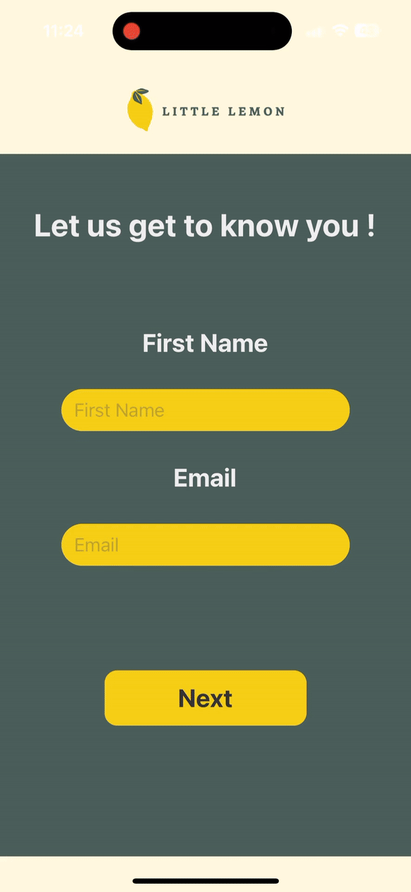

# Little Lemon Restaurant App

React Native food ordering app. 

---

## Features

### 1. **Onboarding Process**
- Get started with a simple and intuitive onboarding experience.
- Add your **first name** and **email** to begin.

<div style="text-align: center;">

</div>

---

### 2. **Browse Menu**
- View the **menu items** with **descriptions** and **prices**.
- Filter items by **category** and use the **search bar** to find your favorites.

<div style="text-align: center;">

</div>

---

### 3. **Profile Management**
- Update your **profile picture**, **personal information**, and **preferences** like special offers and newsletters.

<div style="text-align: center;">

</div>

---

### 4. **Order Preferences**
- Customize your **order preferences**, including opting in for special **offers** and receiving **newsletters**.

<div style="text-align: center;">

</div>


## How to Use

1. **Onboarding**: Start by entering your details.
2. **Browse the Menu**: Search or filter menu items by category.
3. **Manage Profile**: Personalize your information and preferences.
4. **Order**: Choose your desired dishes and customize your experience!

---

## Installation

Follow the instructions below to set up and run the Little Lemon app locally.

```bash
# Clone this repository
git clone https://github.com/mariamBoules/little-lemon-app.git

# Install dependencies
npm install

# Start the app
npm start